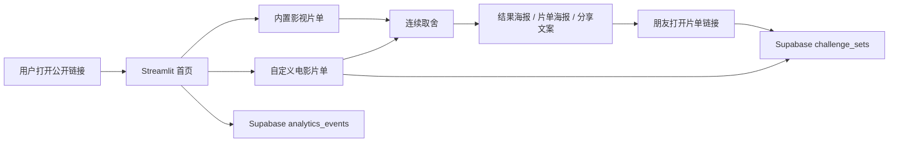

# 电影审美名片 / Film Sort Ranker

一个面向公开分享的 **Streamlit 影视偏好片单页**：用户通过连续二选一，在几分钟内整理出自己的电影审美名单、分享海报和片单链接。

主口号：

> 别再问我最喜欢哪部电影了，我慢慢排出来了。

适合用来做这些事情：

- 排自己的电影 Top 10 / Top 20
- 整理“诺兰作品序列”“宫崎骏动画手记”等同一份片单
- 生成可发朋友圈、小红书、群聊的电影审美名片
- 通过匿名事件数据沉淀访问、开始、完成、分享等简历指标

---

## 项目亮点

- **分享闭环**：内置影视片单 → 连续取舍 → 结果海报 → 片单链接 → 两份名单差异。
- **匿名数据漏斗**：接入 Supabase REST API，记录 `page_view`、`ranking_started`、`ranking_completed`、`share_link_copied` 等事件。
- **隐私优先**：默认不采集姓名、IP、自定义完整名单内容；自定义片单只有在用户主动生成片单链接时才会保存。
- **移动端优先**：首页、取舍卡、复制链接和海报下载都按手机分享场景设计。
- **简历友好**：可用真实访问量、完成率、分享率和用户反馈证明项目影响力。

## 功能特性

### 发布前新增的 18 个体验改进

1. 自定义模式新增热门模板，首次打开不用从空白输入框开始。
2. 候选项输入支持换行、逗号、顿号、分号和竖线智能拆分。
3. 自定义模式支持“只保留前 N 名”，适合几分钟完成的轻量整理。
4. 豆瓣模式新增轻量、标准、细排三种整理深度。
5. 新增署名，结果、海报、导出文件和分享文案都能带上整理者身份。
6. 新增顺序口令，同一候选和同一口令会得到一致的出场顺序，方便朋友整理同一份片单。
7. 新增隐藏过程名单，结束后再揭晓，减少被临时顺序影响。
8. 新增左右随机展示，降低固定位置偏好带来的排序偏差。
9. 取舍卡片支持键盘快捷键 A/D、左右方向键和 1/2。
10. 选择页新增“暂放”，纠结的一组可以稍后处理。
11. 选择页状态栏加入署名、预计剩余、略过和暂放次数。
12. 结果页新增最前面、前三、整理节奏和效率洞察。
13. 分享海报新增留白卡片、银幕红、夜场蓝三种风格。
14. 分享海报新增方图、9:16 长图和自适应长图三种尺寸。
15. 结果页自动生成可直接发布的社交分享文案。
16. 导出新增 Markdown 和“片单 JSON”格式。
17. 好友可以导入彼此的 JSON 名单，查看 Top 5 重合和最大差异。
18. 分享文案会附带顺序口令，引导朋友整理同一份片单。

### 公开发布版新增

- 首页改为“今日片单 + 快速开始 + 示例结果卡”
- 支持 `?list=<id>` 片单链接
- 支持 Supabase 保存可分享片单和匿名事件
- 首页公开展示已整理名单数、今日整理数、平均取舍次数
- 支持 `?admin=<token>` 私密数据看板
- 结果页新增片单海报、片单链接复制、发布文案复制
- 内置首发片单：
  - 豆瓣高分片单
  - 诺兰作品序列
  - 宫崎骏动画手记
  - 华语高分片单
  - 两个人的观影名单

---

## 架构



### 1. 双模式支持

#### 自备片单
- 自己输入主题
- 自己输入候选项池（每行一个）
- 支持完整顺序整理
- 自动去重、去空行

#### 豆瓣高分
- 自动读取豆瓣 Top250 作为候选来源
- 可设置：
  - 最终要保留的前 **K** 名
  - 候选池使用豆瓣前 **N** 部电影
- 自动校验 `N >= K`
- 可选显示电影海报

---

### 2. 三步式交互流程

页面被拆成明确的三个步骤，而不是把所有内容堆在一个界面里：

1. **选片单**
2. **定范围**
3. **作取舍**

这样流程更清晰，也更适合第一次使用的人。

---

### 3. 选择过程功能

整理时会不断展示两部电影，让你选择更喜欢哪一部。

当前支持：

- **更喜欢 A / 更喜欢 B**
- **撤销上一步**
- **未看过 A（略过 A）**
- **未看过 B（略过 B）**

其中“未看过 / 陌生”会把对应电影从本轮候选池中略过，后续不再出现。

---

### 4. 结果页功能

整理完成后会自动生成：

- 最终名单
- 已略过电影数量统计
- **可分享海报（PNG）**
- 海报下载按钮

可分享海报适合直接发朋友圈、发群、发社交平台，或者保存留档。

---

### 5. 豆瓣模式准备阶段优化

在读取豆瓣电影列表和准备海报时，会显示简洁的：

- **准备中...**
- 进度条

不会显示过多技术细节，界面更干净。

---

## 项目截图建议

你可以在 GitHub README 里后续补几张截图，例如：

- 第一步：模式选择页
- 第二步：片单范围页
- 第三步：选择页
- 最终结果页
- 自动生成的分享海报

如果你后面准备公开发布，这部分很重要。

---

## 技术栈

- **Python**
- **Streamlit**：前端页面与交互
- **Requests**：网络请求
- **BeautifulSoup4**：解析豆瓣页面
- **Pillow (PIL)**：生成分享海报

---

## 安装依赖

建议使用虚拟环境或 Conda 环境。

```bash
pip install streamlit requests beautifulsoup4 pillow
```

---

## 运行方式

如果你的主文件是：

```bash
merged_douban_ranker_v3.py
```

则运行：

```bash
streamlit run merged_douban_ranker_v3.py
```

运行后浏览器会自动打开本地页面，默认地址通常为：

```text
http://localhost:8501
```

---

## Supabase 配置

1. 新建 Supabase project。
2. 在 SQL Editor 里执行 [supabase_schema.sql](./supabase_schema.sql)。
3. 在 Streamlit Community Cloud 的 Secrets 里配置：

```toml
SUPABASE_URL = "https://your-project.supabase.co"
SUPABASE_ANON_KEY = "your-anon-key"
PUBLIC_APP_URL = "https://your-app.streamlit.app"
ADMIN_DASHBOARD_TOKEN = "change-this-token"
```

如果没有配置 Supabase，应用仍然可以运行，只是公开统计、短入口和后台看板会自动降级。

---

## 发布到 Streamlit Community Cloud

1. 把仓库推到 GitHub。
2. 在 Streamlit Community Cloud 新建 App，入口文件选择 `merged_douban_ranker_v3.py`。
3. 配置上面的 Secrets。
4. 打开公网 URL，测试内置片单、结果海报、复制片单链接。
5. 用 `?admin=<ADMIN_DASHBOARD_TOKEN>` 打开匿名数据看板。

---

## 首发分享方案

### 第 1 天：先让朋友完成第一批片单

- 发“豆瓣高分片单”和“诺兰作品序列”两个链接。
- 配文：别再问我最喜欢哪部电影了，我慢慢排出来了。你也来排一份，我们看前 3 名差多少。
- 目标：拿到第一批完成数据和真实反馈。

### 第 2-3 天：发小红书 / 豆瓣小组

- 标题候选：
  - 我做了个电影偏好测试，结果比 MBTI 还像我
  - 3 分钟排出你的电影审美名片
  - 你最爱的电影，真的是你以为的那一部吗？
- 内容结构：截图结果海报 → 说玩法 → 放片单链接 → 邀请晒 Top 3。

### 第 4-5 天：发短视频录屏

- 录 30 秒：打开片单链接 → 连续二选一 → 生成海报 → 复制片单链接。
- 重点展示“很快”“能发图”“朋友能整理同一份片单”。

### 第 6-7 天：发第一周复盘

- 截图后台看板：访问数、开始数、完成数、分享数。
- 写一篇 README/朋友圈复盘：做了什么、数据如何、下一步怎么迭代。

---

## 简历写法

如果上线后有真实数据，可以这样写：

- 独立开发并上线影视偏好排序 Web App，设计片单链接与匿名事件漏斗，支持用户通过连续取舍完成电影名单整理与社交分享。
- 接入 Supabase REST API 采集匿名 `page_view/start/complete/share` 事件，用数据追踪完成率、分享率和热门片单。
- 围绕影视爱好者场景优化首屏、移动端取舍体验和分享海报，形成从片单链接到结果分享的完整链路。

可量化后替换为：

> 首周获得 X 次访问、Y 份完成名单、Z% 完成率、W 次分享链接复制，并基于漏斗数据优化首屏和分享链路。

---

## 使用说明

## 方式一：自备片单

适合整理任意主题，例如：

- 华语男歌手偏好排序
- 最喜欢的游戏角色
- 最爱的动漫作品
- 最常去的餐厅

操作流程：

1. 进入第 1 步，选择 **自备片单**
2. 第 2 步填写：
   - 主题名称
   - 候选项列表（每行一个）
3. 进入第 3 步开始连续选择
4. 整理完成后查看结果并下载分享海报

---

## 方式二：豆瓣高分

适合从豆瓣 Top250 里筛出自己的电影前列名单。

操作流程：

1. 进入第 1 步，选择 **豆瓣高分**
2. 第 2 步填写：
   - 主题名称
   - 最终想保留的前 N 名
   - 候选池使用豆瓣前多少部电影
   - 是否显示海报
3. 系统准备候选项后进入选择页面
4. 通过不断二选一得到最终前列名单
5. 结束后自动生成可分享海报

---

## 整理逻辑说明

本项目的核心思路是：

- 不要求用户一次性给出完整顺序
- 而是通过连续的 **A/B 选择**，逐步把候选项插入到当前名单中
- 相比手动拖拽或整表调整，更轻松，也更适合候选项很多的场景

对于豆瓣高分，还支持只保留前 **K** 名，不强求对全部候选项做完整整理。

---

## 项目结构建议

如果你当前仓库里只有一个主文件，也完全没问题。  
如果后续准备继续扩展，建议逐步拆成下面这种结构：

```text
film_sort/
├─ merged_douban_ranker_v3.py   # 主程序
├─ README.md
├─ requirements.txt
├─ cache/                       # 运行时缓存（建议加入 .gitignore）
└─ screenshots/                 # README 展示图片（可选）
```

如果项目继续变大，还可以进一步拆分成：

- `ranking_engine.py`
- `douban_source.py`
- `share_poster.py`
- `ui_pages.py`

---

## requirements.txt 示例

你可以在仓库里加一个 `requirements.txt`：

```txt
streamlit
requests
beautifulsoup4
pillow
```

安装时：

```bash
pip install -r requirements.txt
```

---

## 注意事项

### 1. 豆瓣相关请求可能不稳定
由于豆瓣页面、接口、网络环境、访问频率等因素影响，电影海报或列表获取可能偶尔失败。

当前代码已经尽量做了兼容处理：

- 请求失败不会直接导致整个应用崩溃
- 海报获取失败时，排序功能仍可继续使用

### 2. Streamlit 版本兼容问题
不同版本的 Streamlit 在部分接口上可能有差异。  
当前代码已经尽量对旧版本做了兼容处理，但如果你遇到奇怪问题，优先尝试升级：

```bash
pip install -U streamlit
```

### 3. cache 目录建议忽略
运行时产生的缓存、海报、临时文件通常不建议提交到 GitHub。

建议在 `.gitignore` 中加入：

```gitignore
cache/
__pycache__/
*.pyc
```

---

## 后续可扩展方向

这个项目后面还可以继续做很多增强功能，例如：

- 平局按钮
- 略过当前选择
- 自动保存进度
- 导出 TXT / CSV / JSON
- 多片单来源（IMDb、Letterboxd 等）
- 显示电影年份、导演、评分、简介
- 两份名单差异
- AI 自动生成观影画像
- 分享图模板美化

---

## 适合写在简历 / 项目介绍里的描述

你如果后面要把这个项目写进简历，可以这样描述：

> 基于 Streamlit 开发了一个交互式偏好排序工具，支持自定义候选池与豆瓣电影片单模式，通过连续二选一实现高效整理；支持撤销、未看过项剔除、结果海报自动生成与下载，并将整体流程重构为三步式多页面交互，提升了可用性与项目完整度。

---

## License

如果你准备公开仓库，建议补一个 License，例如：

- MIT License
- Apache-2.0

如果暂时只是个人项目，也可以先不写。

---

## 致谢

- [Streamlit](https://streamlit.io/)
- [Requests](https://requests.readthedocs.io/)
- [Beautiful Soup](https://www.crummy.com/software/BeautifulSoup/)
- 豆瓣电影页面数据来源于公开网页，仅用于学习与个人项目练习

---

## Star

如果你觉得这个项目有意思，欢迎点个 Star。
