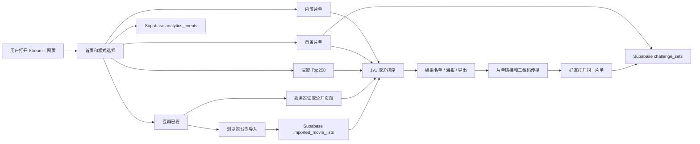

# 电影审美名单 / Film Sort Ranker

一个面向影视爱好者的公开网页应用。它把“从一堆电影里排出第一、第二、第三”这件很费脑的事，拆成多次简单的 1v1 取舍：每次只问你两部电影更偏爱哪一部，最后生成一份属于自己的电影审美名单。

线上地址：[https://sortfilmsgamegit.streamlit.app](https://sortfilmsgamegit.streamlit.app)

核心文案：

> 不必一次想清全部顺序，只在两部电影之间作一次取舍。

适合做这些事：

- 从豆瓣高分、导演作品、华语电影等片单里整理自己的 Top N。
- 输入豆瓣 ID，把自己的“已看电影”整理成私人总榜。
- 自定义一份片单，发给朋友整理同一批电影。
- 生成带电影海报和二维码的结果海报，方便发朋友圈、小红书、豆瓣或群聊。
- 用匿名数据漏斗沉淀真实访问、开始、完成、分享等项目指标。


---

## 当前功能

### 1. 取舍式排序

- 使用二分插入式排序，把复杂总排序拆成连续的二选一。
- 支持只保留前 N 名，也支持完整排序。
- 支持撤销上一步、略过陌生电影、暂放纠结组合。
- 支持盲排模式，过程里隐藏临时名单，结束后再揭晓。
- 支持左右随机展示，减少固定位置偏好。
- 支持键盘快捷键：A / D、左右方向键、1 / 2。
- 支持顺序口令，同一片单和同一口令会得到一致出场顺序，方便朋友比较同题结果。

### 2. 多种片单来源

- **内置片单**：豆瓣高分片单、诺兰作品序列、宫崎骏动画手记、华语高分片单、两个人的观影名单。
- **自备片单**：用户可以粘贴任意电影列表，支持换行、逗号、顿号、分号、竖线等分隔方式。
- **豆瓣高分**：从豆瓣 Top250 中选择候选范围，并整理出自己的前 N 名。
- **豆瓣已看**：输入豆瓣 ID 或“看过”页面链接，整理自己的已看电影总榜。
- **浏览器书签导入**：当服务器直接读取豆瓣已看失败时，用户可以在自己浏览器里用书签工具读取已看列表，生成跨设备可用的片单 ID。


### 3. 海报与分享

- 取舍卡片和结果海报都支持电影海报。
- 海报来源包括豆瓣页面原图、豆瓣 Top250 索引、IMDb 备用源、导入片单附带的原始海报 URL。
- 使用本地缓存和预加载，减少每次选择后的等待。
- 如果没有拿到真实海报，不显示意义不明的错误图片。
- 结果海报内置网站二维码，默认指向应用首页，方便二次传播。
- 支持结果海报和片单海报两种素材。
- 支持 TXT、CSV、Markdown、片单 JSON 导出。
- 支持生成朋友圈、小红书、豆瓣可直接使用的分享文案。
- 支持导入朋友的 JSON 结果，比较 Top 5 重合和最大分歧。

### 4. 公开发布与增长闭环

- 首页是移动端优先的紧凑布局，核心入口在首屏可见。
- 支持 `?list=<id>` 打开同一份片单。
- 支持 `?payload=<data>` 作为 Supabase 未配置时的长链接降级。
- 支持 `?import=<db-id>` 打开浏览器书签导入生成的豆瓣已看片单。
- 支持公开展示已整理名单数、今日整理人数、平均取舍次数。
- 支持 `?admin=<token>` 打开私密匿名数据看板。
- 支持本地浏览器自动保存排序进度，用户退出后回来可以继续。

### 5. 数据与隐私

- 只使用随机 session id，不要求登录。
- 匿名事件包括：`page_view`、`challenge_opened`、`ranking_started`、`ranking_completed`、`poster_downloaded`、`share_link_copied`。
- 默认不记录姓名、IP、联系方式。
- 事件 payload 会过滤完整候选项、完整排名、自定义完整榜单等敏感字段。
- 自定义片单只有在用户主动生成片单链接时才会保存。
- 豆瓣已看浏览器导入会保存到 `imported_movie_lists`，默认 7 天过期，便于跨设备继续。

---

## 技术架构


```mermaid
flowchart LR
  A["用户打开 Streamlit 网页"] --> B["首页和模式选择"]
  B --> C["内置片单"]
  B --> D["自备片单"]
  B --> E["豆瓣 Top250"]
  B --> F["豆瓣已看"]
  F --> G["服务器读取公开页面"]
  F --> H["浏览器书签导入"]
  C --> I["1v1 取舍排序"]
  D --> I
  E --> I
  G --> I
  H --> J["Supabase imported_movie_lists"]
  J --> I
  I --> K["结果名单 / 海报 / 导出"]
  K --> L["片单链接和二维码传播"]
  L --> M["好友打开同一片单"]
  B --> N["Supabase analytics_events"]
  D --> O["Supabase challenge_sets"]
  M --> O
```

### 主要模块

```text
film_sort/
├── merged_douban_ranker_v3.py        # Streamlit 主入口、排序状态、UI、海报生成
├── launch_copy.py                    # 首页文案、内置片单、分享文案、简历和发布清单
├── analytics.py                      # Supabase 匿名事件、公开指标、后台指标
├── challenge_store.py                # 片单链接保存、读取、payload 降级
├── import_store.py                   # 豆瓣已看书签导入、跨设备片单 ID
├── supabase_schema.sql               # Supabase 表结构、索引、RLS 策略
├── components/
│   ├── battle_picker/                # 二选一取舍卡组件
│   ├── copy_button/                  # 一键复制组件
│   ├── local_draft/                  # 浏览器本地自动保存组件
│   └── bookmarklet_link/             # 豆瓣已看书签导入组件
├── promo_assets/                     # 宣传截图、结果海报、配图生成脚本
├── assets/                           # 首页封面素材
├── requirements.txt                  # Python 依赖
└── packages.txt                      # Streamlit Cloud 字体依赖
```

---

## 本地运行

建议使用 Python 3.10+。

```bash
pip install -r requirements.txt
streamlit run merged_douban_ranker_v3.py
```

常用检查：

```bash
python -m py_compile merged_douban_ranker_v3.py analytics.py challenge_store.py import_store.py launch_copy.py
```

没有配置 Supabase 时，应用仍然可以运行；公开统计、短片单链接、豆瓣已看跨设备导入会自动降级或隐藏。

---

## Supabase 配置

Supabase 用来保存匿名事件、可分享片单和浏览器书签导入的豆瓣已看片单。

1. 创建 Supabase project。
2. 在 Supabase SQL Editor 执行 [supabase_schema.sql](supabase_schema.sql)。
3. 在 Streamlit Community Cloud 的 Secrets 里配置：

```toml
SUPABASE_URL = "https://your-project.supabase.co"
SUPABASE_ANON_KEY = "your-anon-key"
PUBLIC_APP_URL = "https://your-app.streamlit.app"
ADMIN_DASHBOARD_TOKEN = "change-this-token"
```

`supabase_schema.sql` 使用 `create table if not exists` 和 `create index if not exists`，重复执行不会删除已有数据。它会更新 RLS policy，如果你已经上线过，执行前仍建议先在 Supabase 里确认当前表名和策略符合预期。

### Supabase 表

- `challenge_sets`：保存用户主动生成的片单链接。
- `analytics_events`：保存匿名事件漏斗。
- `imported_movie_lists`：保存浏览器书签导入的豆瓣已看片单，默认 7 天过期。

---

## 部署到 Streamlit Community Cloud

1. 推送代码到 GitHub。
2. 在 Streamlit Community Cloud 新建应用。
3. 入口文件选择 `merged_douban_ranker_v3.py`。
4. 配置上面的 Secrets。
5. 确认 `packages.txt` 已包含 `fonts-noto-cjk`，否则中文海报可能显示为方块。
6. 打开公网链接，完整测试一次内置片单、结果海报、复制链接、豆瓣已看导入。
7. 用 `?admin=<ADMIN_DASHBOARD_TOKEN>` 检查匿名数据看板。

---

## 豆瓣已看导入说明

### 方式一：直接输入豆瓣 ID

打开豆瓣电影“看过”页面，例如：

```text
https://movie.douban.com/people/123456/collect
```

其中 `123456` 就是豆瓣 ID。这个方式要求“看过”页面公开可访问，且服务器没有被豆瓣安全页拦截。

### 方式二：浏览器书签导入

如果服务器读取豆瓣失败，使用这个方式：

1. 在应用里进入“豆瓣已看”。
2. 打开“电脑导入助手”。
3. 把“导入我的豆瓣已看”拖到浏览器书签栏。
4. 打开自己的豆瓣电影“看过”页面。
5. 点击书签栏里的“导入我的豆瓣已看”。
6. 页面会读取当前浏览器能看到的已看列表，生成一个 `db-` 开头的片单 ID。
7. 手机端或其他设备输入这个 ID，就能继续整理同一份片单。

如果 Chrome 没有保留书签名称，可以手动新建书签：

- 名称：`导入我的豆瓣已看`
- 网址：复制页面里的“导入按钮代码”，必须以 `javascript:` 开头。

---

## 宣传素材

仓库里已经包含几张可直接发帖的素材：

- [promo_assets/01_two_choice_miyazaki.png](promo_assets/01_two_choice_miyazaki.png)：宫崎骏二选一界面。
- [promo_assets/02_result_miyazaki_poster.png](promo_assets/02_result_miyazaki_poster.png)：宫崎骏结果海报。
- [promo_assets/03_douban_collect_two_choice.png](promo_assets/03_douban_collect_two_choice.png)：豆瓣已看二选一界面。
- [promo_assets/04_douban_collect_result_poster.png](promo_assets/04_douban_collect_result_poster.png)：豆瓣已看结果海报。
- [promo_assets/generate_douban_collect_promo.py](promo_assets/generate_douban_collect_promo.py)：豆瓣已看宣传图生成脚本。

推荐首发角度：

> 我一直很难从几百部看过的电影里排出自己的总榜。这个网页把排序拆成很多次二选一，每次只问“两部电影你更喜欢哪部”，最后慢慢排出一份自己的电影审美名单。

---

## 版本更新

这一节按实际 diff 归纳，提交信息只作为定位参考。

### v0.1 原始排序原型

覆盖提交：`618730b`，2026-04-22

- 新增 `sort_rank.py`，实现最初的 Streamlit 二选一排序工具。
- 使用二分插入逻辑，把候选项逐个插入已排序列表。
- 支持输入主题、候选项、开始排序、重置排序、查看临时排序。
- 新增 `film_list.py`，从豆瓣 Top250 页面抓取前 100 个电影标题。
- 新增 `sort_films.py`，把通用排序改造成电影 Top10，并尝试从豆瓣联想接口获取电影海报。

### v0.2 双模式电影版

覆盖提交：`2ec5e43`、`6ab53f8`，2026-04-23

- 合并早期脚本为 `merged_douban_ranker.py`，随后重命名为 `merged_douban_ranker_v2.py`。
- 从“通用偏好排序”升级为“自定义列表 + 豆瓣电影”双模式。
- 引入豆瓣 Top250 候选池和电影海报缓存尝试。
- 增加“未看过 / 陌生”处理思路，避免用户被不熟悉的电影卡住。
- 清理早期提交进仓库的海报缓存文件，减少仓库体积。

### v0.3 工程化和 v3 入口

覆盖提交：`fb1fb54`，2026-05-26

- 新增 `.gitignore`、`requirements.txt`、初版 `README.md`。
- 主程序重命名为 `merged_douban_ranker_v3.py`。
- README 开始记录项目用途、安装方式、运行方式和后续扩展方向。

### v0.4 发布前体验增强

覆盖提交：`01a9c9f`、`0e1b5e8`、`d6cf8a1`、`1965c90`、`8232770`、`322e920`、`b590d8b`、`e39f9a8`、`fed39e2`，2026-05-26 至 2026-05-27

- 新增热门模板，自定义模式不再从空白输入框开始。
- 候选项输入支持多种分隔符和去重清洗。
- 新增 Top N 逻辑，支持只整理前 N 名。
- 豆瓣模式加入不同整理强度预设。
- 新增署名、顺序口令、盲排、左右随机展示。
- 新增暂放、略过、撤销、历史快照等排序过程能力。
- 新增状态栏，显示主题、玩家、进度、比较次数、预计剩余、跳过和暂放。
- 新增结果洞察，包括前三名、比较次数、效率提示等。
- 新增分享海报样式和尺寸选项。
- 新增 Markdown、JSON 等导出能力。
- 新增好友 JSON 名单对比能力。
- 新增准备页和封面素材 `assets/cover_banner.png`。
- 新增 `components/battle_picker`，把二选一卡片从 Streamlit 原生按钮升级为自定义组件，支持键盘快捷键和更稳定的交互。
- 调整 rerun 和刷新逻辑，减少选择后状态不同步的问题。

### v1.0 公开发布版

覆盖提交：`e50a779`、`c65e8d8`、`4385d0a`，2026-06-01

- 新增 `analytics.py`，接入 Supabase REST API 记录匿名事件。
- 新增 `challenge_store.py`，支持保存和读取同一份片单链接。
- 新增 `launch_copy.py`，集中管理首页文案、内置片单、分享文案和简历表达。
- 新增 `components/copy_button`，实现一键复制片单链接和分享文案。
- 新增 `supabase_schema.sql`，定义 `challenge_sets` 和 `analytics_events`。
- 首页改成公开发布页，主打“慢慢排出你的电影审美名单”。
- 支持 `?list=<id>` 和 `?payload=<data>` 打开片单。
- 支持公开指标：已整理名单、今日整理、平均取舍次数。
- 支持 `?admin=<token>` 匿名数据看板，查看访问、开始、完成、复制链接、热门模板和热门片单。
- 文案从“挑战 / 对决 / 玩家”等表达逐步改为“片单 / 取舍 / 名单”，整体更简洁、文艺、适合公开传播。

### v1.1 海报、二维码和移动端优化

覆盖提交：`80b9556`、`3e97bf8`、`7d9e7e5`、`71268a8`、`e76fd6c`，2026-06-01

- 优化海报获取逻辑，增加真实海报校验和失败降级。
- 新增 IMDb 备用海报源和豆瓣 Top250 海报索引兜底。
- 增加海报缓存、预加载和后台预热，减少选择下一项时的等待。
- 结果海报加入电影海报和网站二维码，提升分享识别度。
- 新增 `qrcode` 依赖。
- 新增 `packages.txt`，在 Streamlit Cloud 安装 Noto CJK 字体，修复中文海报字体方块问题。
- 调整移动端二选一卡片布局，让手机屏幕能更快看到两个主要选项。

### v1.2 首页和宣传素材优化

覆盖提交：`543732a`、`c523380`、`007a4c2`，2026-06-02

- 进一步压缩首页纵向空间，把核心交互模块上移。
- 调整内置片单卡片和按钮布局，使移动端更易扫描。
- 调整统计栏位置，把可互动模块放在更前面。
- 修复深色模式下一些卡片文字对比度不足的问题。
- 新增宣传素材 `promo_assets/01_two_choice_miyazaki.png` 和 `promo_assets/02_result_miyazaki_poster.png`。

### v1.3 豆瓣已看总榜

覆盖提交：`935e610`、`79c6a9f`、`26837ab`，2026-06-02

- 新增 `MODE_DOUBAN_COLLECT = "豆瓣已看"`。
- 支持输入豆瓣 ID 或 `/people/<id>/collect` 链接，读取用户公开“看过”电影列表。
- 支持给所有已看电影排序，或只整理 Top N。
- 豆瓣已看成为首页主推功能，配套说明“给你的所有已看排出你的榜单”。
- 增加豆瓣 ID 示例和获取方式说明，避免使用真实用户信息作为示例。
- 已看列表读取时保留海报 URL，进入取舍和结果海报时可继续使用。
- 新增豆瓣已看宣传图和生成脚本。

### v1.4 浏览器本地自动保存

覆盖提交：`0056f77`，2026-06-03

- 新增 `components/local_draft`。
- 将当前排序状态自动保存到浏览器 localStorage。
- 用户退出页面再回来时，可以恢复上次进度。
- 排序完成或重置后会清理对应草稿，避免旧状态干扰新局。

### v1.5 豆瓣已看书签导入

覆盖提交：`a5ad774`、`be6a257`、`840e91a`、`f217453`、`5357cf4`，2026-06-05

- 新增 `import_store.py`。
- Supabase 新增 `imported_movie_lists` 表、索引和 RLS 策略。
- 新增浏览器书签小工具：在用户自己的豆瓣页面中读取“看过”列表，绕开服务器被豆瓣安全页拦截的问题。
- 导入成功后生成 `db-` 开头的片单 ID，并支持 `?import=<db-id>` 打开。
- 支持“已有片单 ID”入口，方便电脑导入后在手机继续。
- 导入失败时保留片单 ID 和错误信息，不再直接回到首页。
- 新增 `components/bookmarklet_link`，提供可拖拽的书签入口。
- 改进书签小工具的编码稳定性，避免中文正则或提示文案在某些环境下被破坏。
- 增加手动复制书签名称和导入按钮代码的兜底方案。

---

## 简历表达

可以这样概括项目：

> 独立开发并上线影视偏好排序 Web App，将复杂排序拆解为连续 1v1 取舍，支持内置片单、自定义片单、豆瓣 Top250、豆瓣已看总榜、结果海报、二维码分享和匿名数据漏斗。

如果上线后拿到真实数据，可以补成量化版本：

> 首周获得 X 次访问、Y 份完成名单、Z% 完成率和 N 次分享链接复制；基于用户反馈迭代豆瓣已看导入、本地自动保存、移动端取舍布局和结果海报传播链路。

可拆成简历 bullet：

- 设计并实现基于二分插入的交互式排序流程，将电影总榜排序简化为连续二选一，支持 Top N、完整排序、撤销、略过、暂放和盲排。
- 接入 Supabase REST API，构建匿名事件漏斗和片单分享存储，支持公开指标与私密后台看板。
- 通过浏览器书签导入方案解决服务器抓取豆瓣已看列表易被安全页拦截的问题，并支持跨设备片单 ID。
- 使用 Pillow、qrcode 和多源海报兜底生成可传播结果海报，围绕小红书、豆瓣、朋友圈场景优化分享链路。

---

## License

当前项目为个人作品。如果准备公开开源，建议补充 MIT License 或 Apache-2.0 License。
