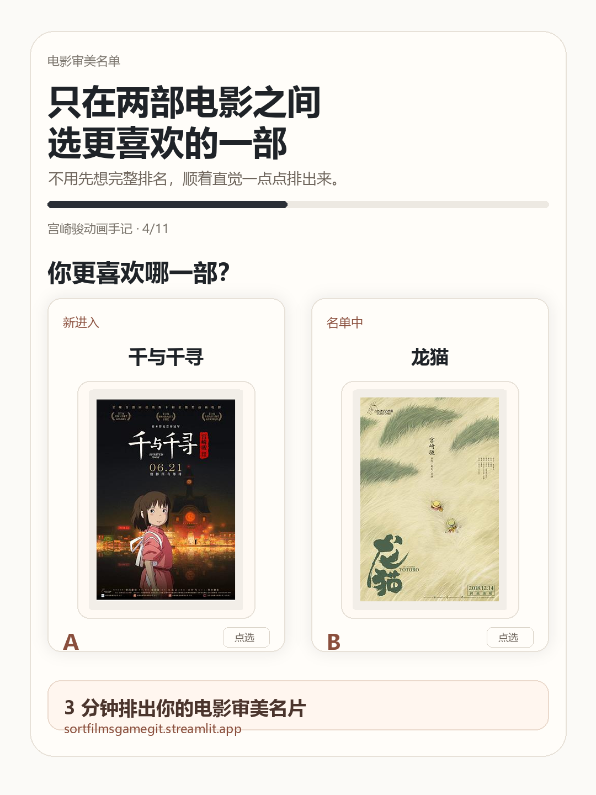
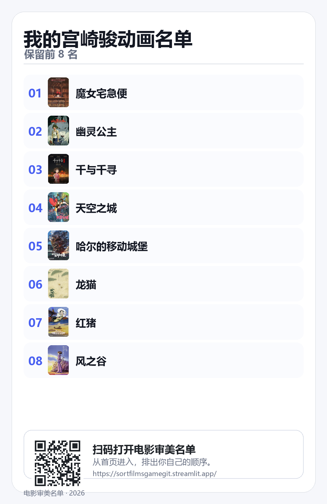
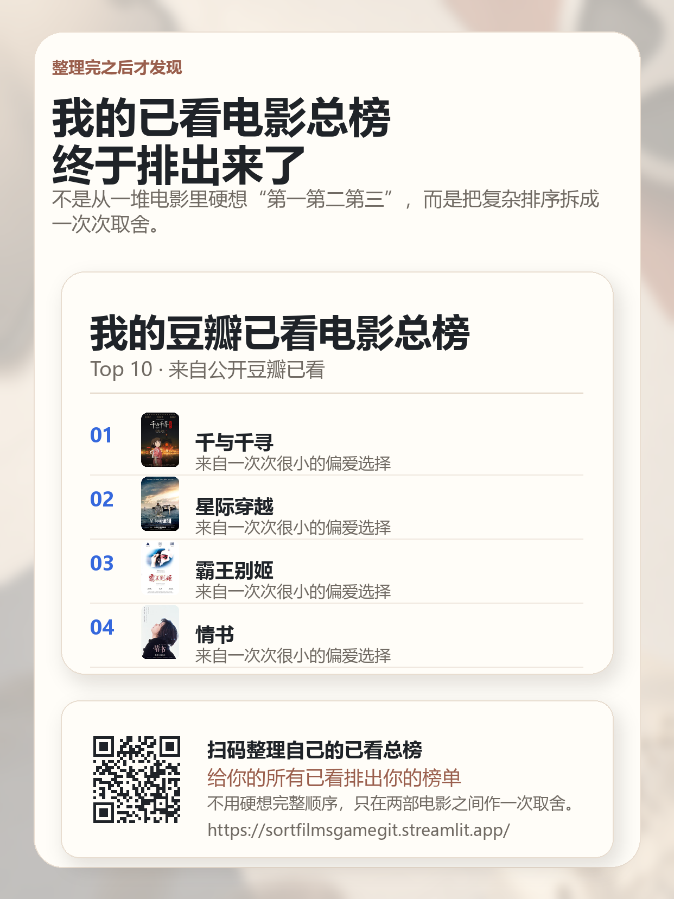
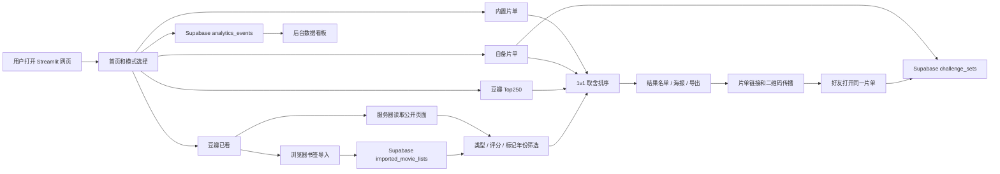

# Sort_FilmsGame / 电影审美名单

## 产品概览

Sort_FilmsGame 是一个影视偏好排序 Web App。它把“手动给几十部电影排出完整顺序”这件高成本任务，拆成连续的 1v1 二选一取舍；用户每次只需要在两部电影之间做选择，最后生成个人电影审美榜单、结果海报、二维码和可追踪的分享链接。

## 线上体验

[https://sortfilmsgamegit.streamlit.app](https://sortfilmsgamegit.streamlit.app)

## Analytics and Product Insights

Film Sort has anonymous product analytics backed by Supabase `analytics_events`.
Current confirmed events include visits, list opens/selections, sorting starts, pairwise comparisons, ranking completions, result views, QR views, poster downloads, and share-copy actions.
Current analysis can support basic funnels, list/template performance, source and device splits, and list-size/comparison summaries.
Funnel reports now state their applicable version, date window, statistical unit, and whether they can be compared horizontally.
Share and poster metrics are split into session-level user conversion rates and event-count action frequency.
A/B experiment analysis uses `experiment_exposed` sessions as the strict denominator; assigned variant sessions are diagnostic only.
The project does not require login for analytics and does not intentionally collect phone numbers, emails, IP addresses, raw user agents, or complete custom rankings in event payloads.
Event taxonomy and data inventory live in [docs/event_taxonomy.md](docs/event_taxonomy.md) and [docs/data_inventory.md](docs/data_inventory.md).
Read-only quality checks live in [analytics/sql/01_data_quality.sql](analytics/sql/01_data_quality.sql), with a safe inspection helper in [analytics/scripts/inspect_analytics.py](analytics/scripts/inspect_analytics.py).
Future analytics work should add only minimal missing fields/events for abandonment and test-traffic isolation; new experiments should use `experiment_exposed` as the strict exposure denominator.
No unverified traffic volume, conversion result, or experiment conclusion is claimed here.

## Product Analytics Case Study

This repository includes a product analytics case study based on real anonymous behavior data.
Read it at [docs/film_sort_product_analytics_case_study.md](docs/film_sort_product_analytics_case_study.md).
Metric definitions are documented in [docs/metrics_contract.md](docs/metrics_contract.md).
Data inventory and event taxonomy live in [docs/data_inventory.md](docs/data_inventory.md) and [docs/event_taxonomy.md](docs/event_taxonomy.md).
The case study publishes aggregate findings only, not raw user events, session identifiers, admin tokens, or sensitive configuration.

## 核心功能

- 1v1 电影偏好排序，支持 Top N 和完整排序。
- 内置豆瓣高分、导演作品、华语高分、主题片单等多种起始片单。
- 支持自定义电影片单，并生成可分享的同题挑战链接。
- 支持豆瓣已看导入，适合整理自己的已看电影总榜，并可按电影 / 剧集类型筛选与开始前预编辑。
- 支持结果海报、二维码分享、复制分享文案和移动端优先交互。
- 支持匿名行为埋点和私密后台数据看板。

## 数据分析与事件埋点

数据分析 v2 使用 Supabase `analytics_events` 保存匿名 session 事件。标准事件包括：

- `visit`
- `list_opened`
- `list_selected`
- `sorting_started`
- `comparison_made`
- `ranking_completed`
- `poster_downloaded`
- `share_copied`
- `result_viewed`
- `qr_viewed`
- `home_content_rendered`

历史事件名会自动映射到新口径，因此旧数据仍然可以在后台看板中继续使用。事件 payload 会记录必要的产品上下文，例如页面路径、片单 ID、模式、渠道 / UTM 参数、片单规模、取舍次数、设备类型、实验 ID 和版本 ID。v3.1 起，豆瓣已看和非模板自备片单完成后会额外保存前 10 名 `top_items`，用于后续内容偏好分析；模板片单仍沿用原有 `winner` 字段。

## 后台数据看板 v2

使用下面的 URL 参数打开私密后台：

```text
?admin=<ADMIN_DASHBOARD_TOKEN>
```

后台数据看板 v2 包含：

- 总览指标：访问数、独立 session、开始整理、完成名单、复制分享、下载海报、开始率、完成率、分享用户转化率、平均分享动作次数、海报下载用户转化率、平均海报下载次数、平均取舍次数、平均整理规模。
- 漏斗分析：同时展示当前埋点 session 总漏斗、轻量片单漏斗、重链路漏斗，以及历史兼容事件数漏斗。
- 重链路漏斗：`list_selected -> sorting_started -> ranking_completed -> share_copied/poster_downloaded`，用于判断豆瓣已看 / 自备片单用户是否卡在填参数到实际开始之间。
- 首页加载诊断：通过 `visit -> home_content_rendered -> list_opened/list_selected/sorting_started` 判断流失更可能发生在加载中还是渲染后。
- 自动识别最大流失环节，并生成产品洞察文案。
- 按 `list_id / template_id / mode` 查看片单维度表现。
- 内容统计：只统计模板片单 `winner`，展示每个模板片单的完成数、冠军 Top3，并生成可下载的冠军榜宣传海报。
- 按 `source / utm_source / utm_medium / utm_campaign` 查看渠道归因。
- 实验分析：按已停止实验 / 正在进行的实验两栏查看实验比例、起止时间、收口版本和历史分版本指标。
- 支持最近 7 天、最近 30 天、全部历史和自定义时间范围筛选。

## A/B 实验框架

实验配置位于 [experiments.py](experiments.py)。当前没有 active 实验；`home_layout_order_v1` 和 `builtin_card_poster_v1` 已停止并全量收口，首页默认先展示内置快速片单，内置片单卡默认显示预制代表电影海报。历史实验配置和事件 payload 仍保留在后台，用于继续复盘分版本表现。

以后新增实验时，一般不需要改后台看板或埋点聚合逻辑。常规流程是：

1. 在 [experiments.py](experiments.py) 里新增一个实验配置块，设置 `experiment_id`、`status`、`traffic_allocation` 和 `variants`。
2. 如果实验只需要被记录和分析，保持 `status = "active"` 即可，事件会自动带上当前 session 命中的实验版本；实验结束后改为 `paused`，并记录 `ended_at` 和 `decision_variant_id`。
3. 如果实验要改变页面或功能表现，在对应业务代码里调用 `get_experiment_config(session_id, experiment_id)` 读取配置，并把配置应用到文案、按钮、默认片单或展示模块。
4. 打开后台数据看板 v2 的 “实验分析” tab，按已停止 / 正在进行查看实验配置；严格实验主分母使用 `experiment_exposed` 去重 session，assigned variant sessions 只作诊断。

## 产品案例与复盘

- [产品案例复盘](docs/product_case_study.md)
- [数据分析 v2 埋点与看板说明](docs/analytics_v2.md)

## 本地运行

```bash
pip install -r requirements.txt
streamlit run merged_douban_ranker_v3.py
```

语法检查：

```bash
python -m py_compile merged_douban_ranker_v3.py analytics.py experiments.py challenge_store.py import_store.py launch_copy.py release_history.py
```

## 隐私说明

本产品只使用匿名行为数据，不采集姓名、联系方式或 IP 等敏感信息。后台数据看板 v2 不展示原始 user_agent，也不会把完整自定义片单或完整排名写入事件 payload。

---

## 详细说明

一个面向影视爱好者的公开网页应用。它把“从一堆电影里排出第一、第二、第三”这件很费脑的事，拆成多次简单的 1v1 取舍：每次只问你两部电影更偏爱哪一部，最后生成一份属于自己的电影审美名单。

线上地址：[https://sortfilmsgamegit.streamlit.app](https://sortfilmsgamegit.streamlit.app)

核心文案：

> 不必一次想清全部顺序，只在两部电影之间作一次取舍。

适合做这些事：

- 从豆瓣高分、导演作品、华语电影等片单里整理自己的 Top N。
- 输入豆瓣 ID，把自己的“已看电影”整理成私人总榜，并可按电影 / 剧集类型、评分、标记年份筛选，开始前还能手动移除暂时不想排的条目。
- 自定义一份片单，发给朋友整理同一批电影。
- 生成带电影海报和二维码的结果海报，方便发朋友圈、小红书、豆瓣或群聊。
- 用匿名数据漏斗和后台看板沉淀真实访问、开始、完成、分享等项目指标。





---

## 当前功能

### 1. 取舍式排序

- 使用二分插入式排序，把复杂总排序拆成连续的二选一。
- 支持只保留前 N 名，也支持完整排序。
- 支持撤销上一步、略过陌生电影、暂放纠结组合。
- 支持盲排模式，过程里隐藏临时名单，结束后再揭晓。
- 支持左右随机展示，减少固定位置偏好。
- 支持键盘快捷键：A / D、左右方向键、1 / 2。
- 支持顺序口令，同一片单和同一口令会得到一致出场顺序，方便朋友比较同题结果。

### 2. 多种片单来源

- **内置片单**：豆瓣高分片单、诺兰作品序列、宫崎骏动画手记、华语高分片单、两个人的观影名单。
- **自备片单**：用户可以粘贴任意电影列表，支持换行、逗号、顿号、分号、竖线等分隔方式。
- **豆瓣高分**：从豆瓣 Top250 中选择候选范围，并整理出自己的前 N 名。
- **豆瓣已看**：输入豆瓣 ID 或“看过”页面链接，整理自己的已看电影总榜；支持按电影 / 剧集类型、豆瓣评分、标记年份筛选，并可在开始前手动移除不想排的条目。
- **浏览器书签导入**：当服务器直接读取豆瓣已看失败时，用户可以在自己浏览器里用书签工具读取已看列表、海报、条目类型、评分和标记日期，生成跨设备可用的片单 ID。




### 3. 海报与分享

- 取舍卡片和结果海报都支持电影海报。
- 海报来源包括豆瓣页面原图、豆瓣 Top250 索引、IMDb 备用源、导入片单附带的原始海报 URL。
- 使用本地缓存和预加载，减少每次选择后的等待。
- 如果没有拿到真实海报，不显示意义不明的错误图片。
- 结果海报可选择带或不带网站二维码，带二维码时默认指向同一份片单或应用首页，方便二次传播。
- 结果页突出冠军电影和最纠结的一组选择，支持复制“猜冠军”文案和同题挑战链接。
- 支持结果海报和片单海报两种素材。
- 支持 TXT、CSV、Markdown、片单 JSON 导出。
- 支持生成朋友圈、小红书、豆瓣可直接使用的分享文案，并沉淀专门的推广文案包。
- 支持导入朋友的 JSON 结果，比较 Top 5 重合和最大分歧。

### 4. 公开发布与增长闭环

- 首页是移动端优先的紧凑布局，首屏用封面式 hero、结果示例卡和行动标签说明完成后能得到什么。
- 内置片单卡片带适用场景推荐，结果页会继续推荐下一份不同气质的片单。
- 支持 `?list=<id>` 打开同一份片单。
- 支持 `?payload=<data>` 作为 Supabase 未配置时的长链接降级。
- 支持 `?import=<db-id>` 打开浏览器书签导入生成的豆瓣已看片单。
- 支持公开展示已整理名单数、今日整理人数、平均取舍次数。
- 支持 `?admin=<token>` 打开私密匿名数据看板，按时间范围查看漏斗、趋势、渠道、内容、行为质量、分享素材和最近事件。
- 支持本地浏览器自动保存排序进度，用户退出后回来可以继续。

### 5. 数据与隐私

- 只使用随机 session id，不要求登录。
- 匿名事件包括：`visit`、`list_opened`、`list_selected`、`sorting_started`、`comparison_made`、`ranking_completed`、`poster_downloaded`、`share_copied`、`result_viewed`、`qr_viewed`、`home_content_rendered`；历史事件名会在后台分析时自动兼容映射。
- 默认不记录姓名、IP、联系方式。
- 事件 payload 会过滤完整候选项、完整排名、自定义完整榜单等敏感字段；豆瓣已看和非模板自备片单仅额外保存完成结果前 10 名。
- 自定义片单只有在用户主动生成片单链接时才会保存。
- 豆瓣已看浏览器导入会保存到 `imported_movie_lists`，默认 7 天过期；其中包含标题、海报 URL、条目类型、评分和标记日期，用于跨设备继续和筛选。

---

## 技术架构


```mermaid
flowchart LR
  A["用户打开 Streamlit 网页"] --> B["首页和模式选择"]
  B --> C["内置片单"]
  B --> D["自备片单"]
  B --> E["豆瓣 Top250"]
  B --> F["豆瓣已看"]
  F --> G["服务器读取公开页面"]
  F --> H["浏览器书签导入"]
  G --> P["类型 / 评分 / 标记年份筛选"]
  H --> J["Supabase imported_movie_lists"]
  J --> P
  C --> I["1v1 取舍排序"]
  D --> I
  E --> I
  P --> I
  I --> K["结果名单 / 海报 / 导出"]
  K --> L["片单链接和二维码传播"]
  L --> M["好友打开同一片单"]
  B --> N["Supabase analytics_events"]
  N --> Q["后台数据看板"]
  D --> O["Supabase challenge_sets"]
  M --> O
```

### 主要模块

```text
film_sort/
├── merged_douban_ranker_v3.py        # Streamlit 主入口、排序状态、UI、海报生成
├── launch_copy.py                    # 首页文案、内置片单、分享文案、简历和发布清单
├── analytics.py                      # Supabase 匿名事件、公开指标、后台漏斗分析
├── challenge_store.py                # 片单链接保存、读取、payload 降级
├── import_store.py                   # 豆瓣已看书签导入、类型/评分/日期清洗、跨设备片单 ID
├── supabase_schema.sql               # Supabase 表结构、索引、RLS 策略
├── components/
│   ├── battle_picker/                # 二选一取舍卡组件
│   ├── copy_button/                  # 一键复制组件
│   ├── local_draft/                  # 浏览器本地自动保存组件
│   └── bookmarklet_link/             # 豆瓣已看书签导入组件
├── promo_assets/                     # 宣传截图、结果海报、配图生成脚本
├── assets/                           # 首页封面素材
├── requirements.txt                  # Python 依赖
└── packages.txt                      # Streamlit Cloud 字体依赖
```

---

## 本地运行

建议使用 Python 3.10+。

```bash
pip install -r requirements.txt
streamlit run merged_douban_ranker_v3.py
```

常用检查：

```bash
python -m py_compile merged_douban_ranker_v3.py analytics.py experiments.py challenge_store.py import_store.py launch_copy.py release_history.py
```

没有配置 Supabase 时，应用仍然可以运行；公开统计、短片单链接、豆瓣已看跨设备导入会自动降级或隐藏。

---

## Supabase 配置

Supabase 用来保存匿名事件、可分享片单和浏览器书签导入的豆瓣已看片单。

1. 创建 Supabase project。
2. 在 Supabase SQL Editor 执行 [supabase_schema.sql](supabase_schema.sql)。
3. 在 Streamlit Community Cloud 的 Secrets 里配置：

```toml
SUPABASE_URL = "https://your-project.supabase.co"
SUPABASE_ANON_KEY = "your-anon-key"
PUBLIC_APP_URL = "https://your-app.streamlit.app"
ADMIN_DASHBOARD_TOKEN = "change-this-token"
```

`supabase_schema.sql` 使用 `create table if not exists` 和 `create index if not exists`，重复执行不会删除已有数据。它会更新 RLS policy，如果你已经上线过，执行前仍建议先在 Supabase 里确认当前表名和策略符合预期。

### Supabase 表

- `challenge_sets`：保存用户主动生成的片单链接。
- `analytics_events`：保存匿名事件漏斗，供公开指标和后台数据看板使用。
- `imported_movie_lists`：保存浏览器书签导入的豆瓣已看片单、条目类型、评分和标记日期，默认 7 天过期。

---

## 部署到 Streamlit Community Cloud

1. 推送代码到 GitHub。
2. 在 Streamlit Community Cloud 新建应用。
3. 入口文件选择 `merged_douban_ranker_v3.py`。
4. 配置上面的 Secrets。
5. 确认 `packages.txt` 已包含 `fonts-noto-cjk`，否则中文海报可能显示为方块。
6. 打开公网链接，完整测试一次内置片单、结果海报、复制链接、豆瓣已看导入。
7. 用 `?admin=<ADMIN_DASHBOARD_TOKEN>` 检查匿名数据看板、时间筛选、漏斗和最近事件导出。

---

## 豆瓣已看导入说明

### 方式一：直接输入豆瓣 ID

打开豆瓣电影“看过”页面，例如：

```text
https://movie.douban.com/people/123456/collect
```

其中 `123456` 就是豆瓣 ID。这个方式要求“看过”页面公开可访问，且服务器没有被豆瓣安全页拦截。

### 方式二：浏览器书签导入

如果服务器读取豆瓣失败，使用这个方式：

1. 在应用里进入“豆瓣已看”。
2. 打开“电脑导入助手”。
3. 把“导入我的豆瓣已看”拖到浏览器书签栏。
4. 打开自己的豆瓣电影“看过”页面。
5. 点击书签栏里的“导入我的豆瓣已看”。
6. 页面会读取当前浏览器能看到的已看列表、海报、条目类型、评分和标记日期，生成一个 `db-` 开头的片单 ID。
7. 手机端或其他设备输入这个 ID，就能继续整理同一份片单。

应用内的书签按钮下方提供“详细导入教程”小按钮，也可以直接打开[豆瓣详细导入教程](https://www.douban.com/doubanapp/dispatch?uri=%2Fgroup%2Ftopic%2F489801091&_spm_id=Mjk1Mzg4OTgz&_i=82214441c34a8be)。

读取或导入成功后，可以先按电影 / 剧集类型、豆瓣评分和豆瓣标记年份筛选；开始前还能在预览列表里点 `×` 手动移除暂时不想排的条目。旧版本导入的片单如果没有类型、评分或日期信息，会显示为未识别类型或提示重新读取；重新读取 / 重新书签导入即可获得完整类型筛选能力。

---

## 宣传素材

仓库里已经包含几张可直接发帖的素材：

- [promo_assets/01_two_choice_miyazaki.png](promo_assets/01_two_choice_miyazaki.png)：宫崎骏二选一界面。
- [promo_assets/02_result_miyazaki_poster.png](promo_assets/02_result_miyazaki_poster.png)：宫崎骏结果海报。
- [promo_assets/03_douban_collect_two_choice.png](promo_assets/03_douban_collect_two_choice.png)：豆瓣已看二选一界面。
- [promo_assets/03_douban_collect_two_choice_guling_bawang.png](promo_assets/03_douban_collect_two_choice_guling_bawang.png)：豆瓣已看二选一界面补充素材。
- [promo_assets/04_douban_collect_result_poster.png](promo_assets/04_douban_collect_result_poster.png)：豆瓣已看结果海报。
- [promo_assets/content_stats_poster_preview_v3_1.png](promo_assets/content_stats_poster_preview_v3_1.png)：v3.1 模板片单冠军榜海报设计预览。
- [promo_assets/generate_douban_collect_promo.py](promo_assets/generate_douban_collect_promo.py)：豆瓣已看宣传图生成脚本。
- [promo_assets/live_screens/mobile_home.png](promo_assets/live_screens/mobile_home.png)：移动端首页实机截图；同目录下保留了连续滚动截图。
- [promo_assets/social_copy_pack.md](promo_assets/social_copy_pack.md)：小红书、豆瓣等渠道的官方/路人视角发布文案。

推荐首发角度：

> 我一直很难从几百部看过的电影里排出自己的总榜。这个网页把排序拆成很多次二选一，每次只问“两部电影你更喜欢哪部”，最后慢慢排出一份自己的电影审美名单。

---

## 版本更新

这一节按实际 diff 归纳，提交信息只作为定位参考。

### v0.1 原始排序原型

覆盖提交：`618730b`，2026-04-22

- 新增 `sort_rank.py`，实现最初的 Streamlit 二选一排序工具。
- 使用二分插入逻辑，把候选项逐个插入已排序列表。
- 支持输入主题、候选项、开始排序、重置排序、查看临时排序。
- 新增 `film_list.py`，从豆瓣 Top250 页面抓取前 100 个电影标题。
- 新增 `sort_films.py`，把通用排序改造成电影 Top10，并尝试从豆瓣联想接口获取电影海报。

### v0.2 双模式电影版

覆盖提交：`2ec5e43`、`6ab53f8`，2026-04-23

- 合并早期脚本为 `merged_douban_ranker.py`，随后重命名为 `merged_douban_ranker_v2.py`。
- 从“通用偏好排序”升级为“自定义列表 + 豆瓣电影”双模式。
- 引入豆瓣 Top250 候选池和电影海报缓存尝试。
- 增加“未看过 / 陌生”处理思路，避免用户被不熟悉的电影卡住。
- 清理早期提交进仓库的海报缓存文件，减少仓库体积。

### v0.3 工程化和 v3 入口

覆盖提交：`fb1fb54`，2026-05-26

- 新增 `.gitignore`、`requirements.txt`、初版 `README.md`。
- 主程序重命名为 `merged_douban_ranker_v3.py`。
- README 开始记录项目用途、安装方式、运行方式和后续扩展方向。

### v0.4 发布前体验增强

覆盖提交：`01a9c9f`、`0e1b5e8`、`d6cf8a1`、`1965c90`、`8232770`、`322e920`、`b590d8b`、`e39f9a8`、`fed39e2`，2026-05-26 至 2026-05-27

- 新增热门模板，自定义模式不再从空白输入框开始。
- 候选项输入支持多种分隔符和去重清洗。
- 新增 Top N 逻辑，支持只整理前 N 名。
- 豆瓣模式加入不同整理强度预设。
- 新增署名、顺序口令、盲排、左右随机展示。
- 新增暂放、略过、撤销、历史快照等排序过程能力。
- 新增状态栏，显示主题、玩家、进度、比较次数、预计剩余、跳过和暂放。
- 新增结果洞察，包括前三名、比较次数、效率提示等。
- 新增分享海报样式和尺寸选项。
- 新增 Markdown、JSON 等导出能力。
- 新增好友 JSON 名单对比能力。
- 新增准备页和封面素材 `assets/cover_banner.png`。
- 新增 `components/battle_picker`，把二选一卡片从 Streamlit 原生按钮升级为自定义组件，支持键盘快捷键和更稳定的交互。
- 调整 rerun 和刷新逻辑，减少选择后状态不同步的问题。

### v1.0 公开发布版

覆盖提交：`e50a779`、`c65e8d8`、`4385d0a`，2026-06-01

- 新增 `analytics.py`，接入 Supabase REST API 记录匿名事件。
- 新增 `challenge_store.py`，支持保存和读取同一份片单链接。
- 新增 `launch_copy.py`，集中管理首页文案、内置片单、分享文案和简历表达。
- 新增 `components/copy_button`，实现一键复制片单链接和分享文案。
- 新增 `supabase_schema.sql`，定义 `challenge_sets` 和 `analytics_events`。
- 首页改成公开发布页，主打“慢慢排出你的电影审美名单”。
- 支持 `?list=<id>` 和 `?payload=<data>` 打开片单。
- 支持公开指标：已整理名单、今日整理、平均取舍次数。
- 支持 `?admin=<token>` 匿名数据看板，查看访问、开始、完成、复制链接、热门模板和热门片单。
- 文案从“挑战 / 对决 / 玩家”等表达逐步改为“片单 / 取舍 / 名单”，整体更简洁、文艺、适合公开传播。

### v1.1 海报、二维码和移动端优化

覆盖提交：`80b9556`、`3e97bf8`、`7d9e7e5`、`71268a8`、`e76fd6c`，2026-06-01

- 优化海报获取逻辑，增加真实海报校验和失败降级。
- 新增 IMDb 备用海报源和豆瓣 Top250 海报索引兜底。
- 增加海报缓存、预加载和后台预热，减少选择下一项时的等待。
- 结果海报加入电影海报和网站二维码，提升分享识别度。
- 新增 `qrcode` 依赖。
- 新增 `packages.txt`，在 Streamlit Cloud 安装 Noto CJK 字体，修复中文海报字体方块问题。
- 调整移动端二选一卡片布局，让手机屏幕能更快看到两个主要选项。

### v1.2 首页和宣传素材优化

覆盖提交：`543732a`、`c523380`、`007a4c2`，2026-06-02

- 进一步压缩首页纵向空间，把核心交互模块上移。
- 调整内置片单卡片和按钮布局，使移动端更易扫描。
- 调整统计栏位置，把可互动模块放在更前面。
- 修复深色模式下一些卡片文字对比度不足的问题。
- 新增宣传素材 `promo_assets/01_two_choice_miyazaki.png` 和 `promo_assets/02_result_miyazaki_poster.png`。

### v1.3 豆瓣已看总榜

覆盖提交：`935e610`、`79c6a9f`、`26837ab`，2026-06-02

- 新增 `MODE_DOUBAN_COLLECT = "豆瓣已看"`。
- 支持输入豆瓣 ID 或 `/people/<id>/collect` 链接，读取用户公开“看过”电影列表。
- 支持给所有已看电影排序，或只整理 Top N。
- 豆瓣已看成为首页主推功能，配套说明“给你的所有已看排出你的榜单”。
- 增加豆瓣 ID 示例和获取方式说明，避免使用真实用户信息作为示例。
- 已看列表读取时保留海报 URL，进入取舍和结果海报时可继续使用。
- 新增豆瓣已看宣传图和生成脚本。

### v1.4 浏览器本地自动保存

覆盖提交：`0056f77`，2026-06-03

- 新增 `components/local_draft`。
- 将当前排序状态自动保存到浏览器 localStorage。
- 用户退出页面再回来时，可以恢复上次进度。
- 排序完成或重置后会清理对应草稿，避免旧状态干扰新局。

### v1.5 豆瓣已看书签导入

覆盖提交：`a5ad774`、`be6a257`、`840e91a`、`f217453`、`5357cf4`，2026-06-05

- 新增 `import_store.py`。
- Supabase 新增 `imported_movie_lists` 表、索引和 RLS 策略。
- 新增浏览器书签小工具：在用户自己的豆瓣页面中读取“看过”列表，绕开服务器被豆瓣安全页拦截的问题。
- 导入成功后生成 `db-` 开头的片单 ID，并支持 `?import=<db-id>` 打开。
- 支持“已有片单 ID”入口，方便电脑导入后在手机继续。
- 导入失败时保留片单 ID 和错误信息，不再直接回到首页。
- 新增 `components/bookmarklet_link`，提供可拖拽的书签入口。
- 改进书签小工具的编码稳定性，避免中文正则或提示文案在某些环境下被破坏。
- 增加手动复制书签名称和导入按钮代码的兜底方案。

### v1.6 豆瓣已看评分筛选与 README 重写

覆盖提交：`3e0f9c8`，2026-06-07

- README 从早期说明文档重写为公开项目介绍，新增功能总览、技术架构、部署说明、导入说明、宣传素材、版本更新和简历表达。
- 豆瓣已看服务器读取和浏览器书签导入开始解析豆瓣评分，支持 1 至 5 星评分清洗。
- `ImportedMovieList` 增加 `entries`、`rating_map` 和 `has_rating_data`，保留导入片单里的结构化评分信息。
- 豆瓣已看准备页新增评分筛选，支持“全部”“4 星及以上”“只看 5 星”“清空星级”和手动多选星级。
- 支持包含或排除未评分 / 未识别评分电影，并在当前筛选不足 2 部时阻止开始排序。
- 旧导入片单没有评分信息时给出提示，引导用户重新读取或继续整理全部电影。

### v1.7 后台数据看板 v1

覆盖提交：`1aa917b`，2026-06-08

- `analytics.py` 从简单近期指标扩展为分页读取历史事件、日期过滤、漏斗计算、分组统计、直方图和事件表导出。
- 新增后台数据看板页，支持近 7 天、近 30 天、近 90 天、全部历史和自定义时间范围。
- 后台指标增加访问、开始、完成、复制分享、下载海报、唯一 session、开始率、完成率、分享率、海报下载率等核心口径。
- 新增主漏斗和共享片单漏斗，方便区分自然访问链路与片单传播链路。
- 新增每日趋势、来源渠道、模式表现、模板表现、热门片单、冠军电影分布等分析视图。
- 新增行为质量分析，包括取舍次数中位数、P75、P90、平均暂放、Top K 设置分布和交互设置使用率。
- 新增分享入口和海报类型拆分、最近事件表格、当前事件 CSV 下载。
- 新增 `pandas` 依赖，用于后台表格、图表和 CSV 数据处理。

### v1.8 豆瓣已看标记年份筛选与推广素材

覆盖提交：`6ec8572`，2026-06-09

- 豆瓣已看服务器读取和浏览器书签导入开始解析“看过”页面里的标记日期，并标准化为 `YYYY-MM-DD`。
- `ImportedMovieList` 增加 `rated_at_map` 和 `has_rated_at_data`，导入片单可保留评分、海报和标记日期三类辅助信息。
- 豆瓣已看准备页的评分筛选升级为“评分 + 标记年份”组合筛选。
- 年份筛选支持“全部年份”“今年”“去年”“清空年份”、指定年份多选，以及包含 / 排除未识别年份。
- 预览区域改为展示“当前筛选后的片单”，并同步展示筛选后电影数量和预计取舍次数。
- 修复片单 ID 打开、失败重试和预览状态之间的渲染状态冲突，避免读取导入片单时输入框状态被错误回写。
- 新增 `promo_assets/social_copy_pack.md`，整理小红书和豆瓣的官方 / 路人视角发布文案。
- 新增移动端首页实机截图、滚动截图和豆瓣已看补充宣传图，方便后续发布和复盘。

### v1.9 首页与结果页转化优化

覆盖提交：`c731491`、`71cc5e0`，2026-06-11

- 首页 hero 改为封面式视觉区，加入结果示例卡和“Top 榜单 / 冠军电影 / 结果海报 / 同题挑战”行动标签。
- 内置片单卡片从 5 列紧凑展示调整为更易扫描的 3 列布局，并新增适用场景推荐文案。
- 排序历史增加 `decision_log`，记录选择和暂放事件，用于结果页识别最纠结的一组电影。
- 结果页新增完成页头，突出本次名单主题、冠军电影、最纠结选择和总取舍次数。
- 结果海报区域改为左侧预览、右侧行动面板，支持下载海报、保存图片、复制链接、复制“猜冠军”文案。
- 结果海报新增二维码版本选项，可生成带二维码或不带二维码的版本。
- 新增“再生成一种风格”按钮，快速轮换海报风格并刷新预览。
- 完成后推荐下一份不同气质的内置片单，延长用户继续整理和分享的路径。

### v2.0 后台看板 v2 与 A/B 实验基础设施

覆盖提交：`0c8352b`，2026-06-12

- 后台数据看板升级为 v2，统一使用 Supabase `analytics_events` 的标准事件口径。
- 后台新增总览指标、片单维度、渠道归因、A/B 实验表现和自定义时间范围筛选。
- 新增 `experiments.py`，用稳定 session 哈希分桶，支持配置实验 ID、流量、实验版本和页面文案 / 布局变量。
- 新增 `home_layout_order_v1` 实验，用于比较“快速开始片单前置”和“豆瓣已看主推前置”的转化差异。
- 新增 [docs/analytics_v2.md](docs/analytics_v2.md) 和 [docs/product_case_study.md](docs/product_case_study.md)，补齐埋点、看板和产品复盘说明。
- 新增 GitHub AI review workflow 文件，开始把代码审查自动化纳入仓库。

### v2.1 新版埋点与后台看板优化

覆盖提交：`4e7b66e`，2026-06-13

- 新增 `home_content_rendered` 事件，用来区分首页没有加载完就流失，还是加载完成后没有继续操作。
- 后台漏斗拆分为当前埋点总漏斗、轻量片单漏斗、重链路漏斗和历史兼容事件数漏斗。
- 新增首页加载诊断：按 `visit -> home_content_rendered -> list_opened/list_selected/sorting_started` 分析加载中流失和渲染后无行动。
- 后台自动识别最大流失环节，并生成面向产品迭代的洞察文案。
- README 和 `docs/analytics_v2.md` 同步更新新版事件、漏斗和看板口径。

### v2.2 新增王家卫 / 新海诚 / 迪士尼片单

覆盖提交：`6133044`，2026-06-13

- 内置片单新增“王家卫电影榜”，覆盖《重庆森林》《花样年华》《春光乍泄》等作品。
- 内置片单新增“新海诚动画电影榜”，覆盖《秒速5厘米》《你的名字。》《铃芽之旅》等作品。
- 内置片单新增“迪士尼动画长片榜”，聚焦华特迪士尼动画工作室长片。
- 为三份新片单补充推荐语、默认 Top N、稳定顺序口令和首页卡片展示信息。
- 新增 `promo_assets/builtin_list_posters/` 下的片单宣传图，并补充生成脚本。

### v2.3 首页加载优化与版本分析

覆盖提交：`5508735`，2026-06-13

- 新增 `release_history.py`，集中管理 `APP_VERSION`、`release_id`、版本名称、上线时间和历史版本时间线。
- 匿名事件 payload 自动带上当前版本上下文，历史事件没有版本字段时可按 `created_at` 回落到对应版本区间。
- 后台新增“版本分析”入口，按版本统计事件数、session、首页渲染完成率、开始率、完成率、分享率和渲染耗时。
- 首页加入“第一次打开可能需要几秒”的加载提示，配合首页加载事件判断首屏体验问题。
- 将部分重依赖改为按需初始化，降低首页加载阶段的无谓开销。

### v2.4 后台看板版本数据分析

覆盖提交：`abb13d0`，2026-06-13

- 版本分析增加事件窗口、首页参与 session、加载中流失、渲染后行动率和 P75 / P90 渲染耗时。
- 后台版本页新增“版本总览”“版本趋势”“相邻版本对比”和“单版本详情”。
- 支持选择单个版本查看相对上一版本的首页渲染完成率、加载中流失率、开始率、完成率和分享率变化。
- 对缺少版本字段的历史事件继续使用 `release_history.py` 的上线时间归因，保证旧数据仍可分析。

### v2.5 后台缺失值修正与同好联系方式

覆盖提交：`5294b59`，2026-06-13

- 后台版本分析补充缺失值展示兜底，避免空值在表格和相邻版本对比中显示异常。
- Supabase schema 新增 `peer_match_contacts` 表、索引和 RLS 策略，用于保存用户自愿公开的联系方式。
- 结果页新增同好匹配逻辑：轻量片单优先匹配冠军相同，重榜单按前十重合度筛选。
- 用户可在结果页自愿留下微信号；提交后，联系方式只会展示给结果相似的用户。
- 结果页可展示匹配到的同好联系方式和重合条目，为“排完之后找同好”建立第一版闭环。

### v2.6 结果页好友推荐入口优化

覆盖提交：`bab7f47`，2026-06-14

- 将“推荐好友”和“留下联系方式”从结果页底部 / 折叠区域移动到结果海报右侧行动区。
- 社交入口改为直接展示两个标题、说明、同好列表和联系方式输入框，减少用户需要额外展开的步骤。
- 同好卡片支持紧凑列表展示，右侧行动面板在空间有限时保持更稳定的阅读布局。
- 联系方式输入改为“微信号 / 联系方式”，提交后继续复用相似榜单展示逻辑。
- `release_history.py` 当前版本更新为 `v2.6-result-peer-entry`，为后续版本分析保留记录。

### v2.7 豆瓣已看类型筛选与片单预编辑

覆盖提交：当前工作区，2026-06-17

- 豆瓣已看服务器读取和浏览器书签导入开始区分电影与剧集，分别读取 `type=movie` 和 `type=tv` 并写入 `media_type`。
- 豆瓣已看准备页新增“按条目类型筛选”，可保留全部、只看电影、只看剧集，旧导入片单的无类型条目归为未识别类型。
- 预览列表升级为可编辑候选表，每个条目旁边可点 `×`，开始整理前排除暂时不想排的片。
- 手动移除只影响本次整理，不改 Supabase 里的导入片单 ID；提供“恢复全部”一键还原。
- 新增 [docs/version_updates/version2.7.md](docs/version_updates/version2.7.md) 记录版本细节、兼容性和测试清单。

### v2.8 后台看板百万事件读取

覆盖提交：`de8a00d`，2026-06-17

- 后台看板主读取从最多 50,000 条历史事件提升到最多 1,000,000 条历史事件。
- 新增 `ADMIN_EVENT_PAGE_SIZE` 和 `ADMIN_EVENT_MAX_ROWS` 常量，集中管理后台分页大小和总读取上限。
- 保持时间范围筛选逻辑不变，仍支持最近 7 天、最近 30 天、全部历史和自定义范围。
- 解决事件累计超过 50,000 条后，“全部历史”也只覆盖最近一段事件，导致早期版本 / 早期日期数据被挤出统计窗口的问题。
- 新增 [docs/version_updates/version2.8.md](docs/version_updates/version2.8.md) 记录版本细节、风险说明和测试清单。

### v2.9 豆瓣导入详细教程入口

覆盖提交：`18132b2`，2026-06-23

- 在“电脑导入助手 > 第一次导入”的书签按钮说明下方新增“详细导入教程”小按钮。
- 按钮位于说明文字与“拖不动？手动复制导入按钮代码”折叠栏之间，不改变现有导入步骤。
- 点击按钮会在新标签页打开豆瓣详细导入教程，并使用 `noopener noreferrer` 隔离原页面。
- 教程按钮使用独立轻量样式，视觉层级低于“导入我的豆瓣已看”主按钮。
- 新增 [docs/version_updates/version2.9.md](docs/version_updates/version2.9.md) 记录入口位置、目标链接和测试清单。

### v2.10 轻量片单海报 A/B 实验

覆盖提交：当前工作区，2026-06-23

- 删除豆瓣电脑导入助手中“拖不动？手动复制导入按钮代码”整栏，保留主书签按钮和详细教程入口。
- 为 8 份内置轻量片单固定代表电影，并提交 `136×192` WebP 缩略海报；运行时只读取仓库静态资源，不联网寻找海报。
- 新增 `builtin_card_poster_v1` 实验，控制组保持纯文字卡片，实验组在卡片右上角显示代表电影海报，流量比例 1:1。
- 海报实验与 `home_layout_order_v1` 并行运行；卡片链接携带两个实验版本和 `entry_surface=home_builtin_card`，进入片单后继续沿用原分桶。
- 后台实验分析新增首页曝光、内置片单打开和卡片打开率，主指标为内置片单打开 session / 首页曝光 session。
- 新增 [docs/version_updates/version2.10.md](docs/version_updates/version2.10.md)，并更新 [docs/analytics_v2.md](docs/analytics_v2.md) 的并行实验和指标口径。

### v3.1 模板内容统计与冠军榜海报

覆盖提交：当前工作区，2026-06-24

- 豆瓣已看和非模板自备片单完成后新增 `top_items` 埋点，只保存前 10 名，不保存完整排名。
- 后台新增“内容统计”tab，只统计模板片单 `winner`，展示每个模板片单的完成数、可统计冠军数和冠军 Top3。
- 后台可根据内容统计生成带前三名电影海报的模板片单冠军榜宣传海报，并提供 PNG 下载。
- 新增 [promo_assets/content_stats_poster_preview_v3_1.png](promo_assets/content_stats_poster_preview_v3_1.png) 作为上线前设计预览。
- 新增 [docs/version_updates/version3.1.md](docs/version_updates/version3.1.md)，并更新 [docs/analytics_v2.md](docs/analytics_v2.md) 的 `top_items` 和内容统计口径。

### v3.2 实验收口与后台分析优化

覆盖提交：当前工作区，2026-06-25

- 结束 `home_layout_order_v1` 和 `builtin_card_poster_v1` 两个 A/B 实验，保留历史 variants、比例和分版本事件用于复盘。
- 首页布局全量收口到 `builtin_first`，默认先展示内置快速片单，再展示豆瓣已看主推。
- 内置轻量片单卡全量收口到 `poster`，默认显示预制代表电影海报。
- 后台 “实验分析” tab 改为已停止实验 / 正在进行的实验两栏，展示实验比例、起止时间、收口版本和历史分版本指标。
- 新增 [docs/version_updates/version3.2.md](docs/version_updates/version3.2.md)，并更新 [docs/analytics_v2.md](docs/analytics_v2.md) 的实验收口和后台分析口径。

### v3.3 Analytics metric contract cleanup

- 后台漏斗和 HTML 导出新增口径卡片，明确适用版本、统计窗口、统计单位和是否可横向比较。
- 分享/下载指标拆成用户转化率与平均动作次数，不再用单一“分享率”混合表达。
- 新增 `experiment_exposed` 事件，实验主分母改为真实曝光 session，assigned sessions 仅作诊断。
- 新增 [docs/version_updates/version3.3.md](docs/version_updates/version3.3.md)，并更新 [docs/analytics_v2.md](docs/analytics_v2.md) 与 [docs/metrics_contract.md](docs/metrics_contract.md) 的指标口径。

---

## 简历表达

可以这样概括项目：

> 独立开发并上线影视偏好排序 Web App，将复杂排序拆解为连续 1v1 取舍，支持内置片单、自定义片单、豆瓣 Top250、豆瓣已看类型/评分/年份筛选、开始前片单预编辑、结果海报、二维码分享和匿名数据看板。

如果上线后拿到真实数据，可以补成量化版本：

> 首周获得 X 次访问、Y 份完成名单、Z% 完成率和 N 次分享链接复制；基于用户反馈迭代豆瓣已看导入、类型/评分/年份筛选、开始前片单预编辑、本地自动保存、移动端取舍布局和结果页传播链路。

可拆成简历 bullet：

- 设计并实现基于二分插入的交互式排序流程，将电影总榜排序简化为连续二选一，支持 Top N、完整排序、撤销、略过、暂放和盲排。
- 接入 Supabase REST API，构建匿名事件漏斗和片单分享存储，支持公开指标、日期筛选、渠道/模板分析和事件导出。
- 通过浏览器书签导入方案解决服务器抓取豆瓣已看列表易被安全页拦截的问题，并解析电影 / 剧集类型、豆瓣评分和标记日期，支持跨设备片单 ID 与开始前候选列表预编辑。
- 使用 Pillow、qrcode 和多源海报兜底生成可传播结果海报，支持二维码开关、猜冠军文案和同题挑战链接。

---

## License

当前项目为个人作品。如果准备公开开源，建议补充 MIT License 或 Apache-2.0 License。
